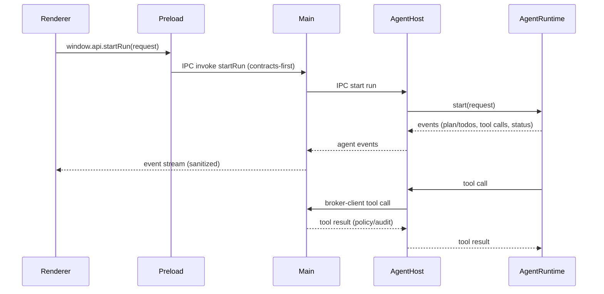

# ai-shell Architecture

This document describes the technical architecture of ai-shell, focusing on the secure multi-process design, IPC communication, and security model.

## Process Architecture

ai-shell uses Electron's multi-process architecture with strict security boundaries:

### Process Boundary Diagram

```
┌─────────────────────────────────────────┐
│  Renderer Process (Sandboxed)           │
│                                          │
│  • React 18 + Tailwind 4                │
│  • No Node.js access                    │
│  • No Electron APIs                     │
│  • Communicates via window.api only     │
│                                          │
│  Security:                               │
│  - contextIsolation: true               │
│  - sandbox: true                        │
│  - nodeIntegration: false               │
└──────────────┬──────────────────────────┘
               │
               │ contextBridge
               │ window.api.*
               │
┌──────────────▼──────────────────────────┐
│  Preload Script (Privileged Context)    │
│                                          │
│  • Runs before renderer loads           │
│  • Has access to contextBridge          │
│  • Exposes minimal API to renderer      │
│  • Wraps ipcRenderer.invoke()           │
│                                          │
│  Exports:                                │
│  - window.api.getVersion()              │
│  - window.api.* (type-safe methods)     │
└──────────────┬──────────────────────────┘
               │
               │ ipcRenderer.invoke()
               │ ipcMain.handle()
               │
┌──────────────▼──────────────────────────┐
│  Main Process (Full Privileges)         │
│                                          │
│  • Node.js and Electron APIs            │
│  • BrowserWindow management             │
│  • IPC handlers                         │
│  • OS access (fs, keychain, etc.)       │
│  • App lifecycle management             │
│                                          │
│  Responsibilities:                       │
│  - Create/manage windows                │
│  - Handle IPC requests                  │
│  - Access file system                   │
│  - Manage secrets via safeStorage       │
└─────────────────────────────────────────┘
```

### Agentic Flow (Mermaid)



### Agent Edit Workflow (Copilot Chat)

- Renderer collects attachments (active file or selection) and sends `window.api.agents.requestEdit`.
- Main validates the request and starts an agent-host run with `workflow=edit`.
- Agent-host emits `edit-proposal` events that are persisted as conversation entries; stored attachments omit snippets.
- Renderer previews the proposal diff and applies edits via `PatchApplyService` with workspace path validation.

### Built-in Agent Tools

Initial built-in tools registered via `packages/agent-tools`:
- `repo.search` (ripgrep-based search scoped to the workspace)
- `workspace.read`
- `workspace.write`
- `workspace.update`

## Search + Source Control

Search and SCM features are implemented as main-process services with contracts-first IPC.

### SearchService

**Location**: `apps/electron-shell/src/main/services/SearchService.ts`

**Responsibilities**:
- Execute workspace-scoped search via `rg --json`
- Parse matches into structured results
- Enforce `maxResults` and return `truncated`
- Execute replace operations in main only

**IPC Channels**:
- `search:query`
- `search:replace`

**Renderer Entry Point**:
- `window.api.search.query()`
- `window.api.search.replace()`

### GitService

**Location**: `apps/electron-shell/src/main/services/GitService.ts`

**Responsibilities**:
- Validate workspace is a Git repo (no network operations)
- Parse `git status --porcelain=v1 -z` into grouped status
- Stage/unstage files or all changes
- Commit with a sanitized message

**IPC Channels**:
- `scm:status`
- `scm:stage`
- `scm:unstage`
- `scm:commit`

**Renderer Entry Point**:
- `window.api.scm.status()`
- `window.api.scm.stage()`
- `window.api.scm.unstage()`
- `window.api.scm.commit()`

## IPC Communication Flow

### Request/Response Pattern

All renderer-to-main communication follows a request/response pattern using `invoke/handle`:

```
┌──────────────┐
│   Renderer   │  1. window.api.getVersion()
└──────┬───────┘
       │
       ▼
┌──────────────┐
│   Preload    │  2. ipcRenderer.invoke(IPC_CHANNELS.GET_VERSION)
└──────┬───────┘
       │
       ▼
┌──────────────┐
│     Main     │  3. ipcMain.handle(IPC_CHANNELS.GET_VERSION, async () => {...})
└──────┬───────┘
       │
       │ 4. Returns AppInfo
       │
       ▼
┌──────────────┐
│   Renderer   │  5. Promise<AppInfo> resolves
└──────────────┘
```

### Example: Getting Version Info

**1. Contract Definition** (packages/api-contracts):

```typescript
// src/types/app-info.ts
import { z } from 'zod';

export const AppInfoSchema = z.object({
  version: z.string(),
  electronVersion: z.string(),
  chromeVersion: z.string(),
  nodeVersion: z.string(),
});

export type AppInfo = z.infer<typeof AppInfoSchema>;

// src/ipc-channels.ts
export const IPC_CHANNELS = {
  GET_VERSION: 'app:get-version',
} as const;

// src/preload-api.ts
export interface PreloadAPI {
  getVersion(): Promise<AppInfo>;
  windowControls: {
    minimize(): Promise<void>;
    toggleMaximize(): Promise<void>;
    close(): Promise<void>;
    getState(): Promise<{ isMaximized: boolean }>;
    onStateChange(handler: (_event: Electron.IpcRendererEvent, state: { isMaximized: boolean }) => void): void;
  };
}

declare global {
  interface Window {
    api: PreloadAPI;
  }
}
```

**2. Main Process Handler** (apps/electron-shell/src/main/ipc-handlers.ts):

```typescript
import { ipcMain, app } from 'electron';
import { IPC_CHANNELS, AppInfo } from 'packages-api-contracts';

export function registerIPCHandlers() {
  ipcMain.handle(IPC_CHANNELS.GET_VERSION, async () => {
    const info: AppInfo = {
      version: app.getVersion(),
      electronVersion: process.versions.electron,
      chromeVersion: process.versions.chrome,
      nodeVersion: process.versions.node,
    };
    return info;
  });
}
```

**3. Preload Exposure** (apps/electron-shell/src/preload/index.ts):

```typescript
import { contextBridge, ipcRenderer } from 'electron';
import { IPC_CHANNELS, PreloadAPI } from 'packages-api-contracts';

const api: PreloadAPI = {
  getVersion: () => ipcRenderer.invoke(IPC_CHANNELS.GET_VERSION),
  windowControls: {
    minimize: () => ipcRenderer.invoke(IPC_CHANNELS.WINDOW_MINIMIZE),
    toggleMaximize: () => ipcRenderer.invoke(IPC_CHANNELS.WINDOW_TOGGLE_MAXIMIZE),
    close: () => ipcRenderer.invoke(IPC_CHANNELS.WINDOW_CLOSE),
    getState: () => ipcRenderer.invoke(IPC_CHANNELS.WINDOW_GET_STATE),
    onStateChange: (handler) => ipcRenderer.on(IPC_CHANNELS.WINDOW_STATE_CHANGED, handler),
  },
};

contextBridge.exposeInMainWorld('api', api);
```

**4. Renderer Usage** (apps/electron-shell/src/renderer/App.tsx):

```typescript
import { useState, useEffect } from 'react';
import type { AppInfo } from 'packages-api-contracts';

export function App() {
  const [versionInfo, setVersionInfo] = useState<AppInfo | null>(null);

  useEffect(() => {
    window.api.getVersion().then(setVersionInfo).catch(console.error);
  }, []);

  return (
    <div>
      {versionInfo && (
        <>
          <p>App: {versionInfo.version}</p>
          <p>Electron: {versionInfo.electronVersion}</p>
        </>
      )}
    </div>
  );
}
```

### Global Error Handling + Safe Mode

ai-shell uses contracts-first diagnostics IPC and a Result envelope to avoid
unhandled errors crossing process boundaries.

**Result envelope rule**
- IPC handlers that can fail return `Result<T>` (`{ ok: true, value } | { ok: false, error }`).
- Main uses `handleSafe()` to prevent throws across IPC boundaries.
- Preload uses `invokeSafe()` so renderer always receives `Result<T>`.

**Diagnostics IPC channels**
- `diag:report-error` — fire-and-forget error reports from renderer/preload.
- `diag:get-log-path` — returns the local diagnostics log path.
- `diag:set-safe-mode` — toggles Safe Mode and relaunches the app.
- `diag:on-fatal` — main -> renderer fatal error event.

**Crash recovery policy**
- Renderer crash (`render-process-gone`) triggers a reload first.
- Repeated renderer crashes within a short window trigger window recreation.
- Main fatal errors relaunch immediately; crash-loop detection enables Safe Mode.

**Safe Mode behavior**
- State is persisted in `userData/runtime-state.json` (non-secret).
- When enabled, agent-host and extension-host are not started.
- Safe Mode never weakens security flags (`contextIsolation`, `sandbox`, etc.).

## Security Model

### Defense in Depth

ai-shell implements multiple layers of security:

#### Layer 1: Process Isolation (P1)

- **Main process**: Has full OS access, manages windows, handles IPC
- **Renderer process**: Fully sandboxed, no Node.js/Electron access
- **Preload script**: Minimal API bridge with curated methods

**Verification**:
```javascript
// In renderer DevTools console:
typeof process   // "undefined" ✓
typeof require   // "undefined" ✓
typeof window.api // "object" ✓
```

#### Layer 2: Security Defaults (P2)

BrowserWindow configuration (apps/electron-shell/src/main/index.ts):

```typescript
const mainWindow = new BrowserWindow({
  webPreferences: {
    // Isolate preload/renderer contexts
    contextIsolation: true,
    
    // Enable Chromium sandbox
    sandbox: true,
    
    // Disable Node.js in renderer
    nodeIntegration: false,
    
    // Load preload script
    preload: path.join(__dirname, 'preload.js'),
  },
});
```

**Never use**:
- ❌ `webSecurity: false`
- ❌ `nodeIntegration: true`
- ❌ `contextIsolation: false`
- ❌ `sandbox: false`

#### Layer 3: Secrets Management (P3)

**Rules**:
- Never store secrets in code or .env files
- Never log secrets (even redacted)
- Use Electron's `safeStorage` API exclusively
- Handle secrets only in main process

#### Child process environment allowlist

Extension Host and Agent Host processes receive a filtered environment. Only the
following variables are forwarded by default:
- PATH/Path, PATHEXT
- SYSTEMROOT, WINDIR, COMSPEC
- TEMP, TMP, TMPDIR
- HOME, USERPROFILE, HOMEPATH, HOMEDRIVE
- APPDATA, LOCALAPPDATA
- XDG_DATA_HOME, XDG_CONFIG_HOME, XDG_CACHE_HOME, XDG_RUNTIME_DIR
- SHELL, TERM, TERM_PROGRAM, TERM_PROGRAM_VERSION
- LANG, LC_ALL, LC_CTYPE

Explicit entries added by the main process:
- NODE_ENV
- EXTENSIONS_DIR (extension host only)
- ELECTRON_RUN_AS_NODE (for forked Node child processes)

Terminal sessions use the same allowlist. TerminalService filters user-provided
env to allowlisted keys only, and does not inject NODE_ENV or EXTENSIONS_DIR.

**Example** (future implementation):

```typescript
// Main process only
import { safeStorage } from 'electron';

// Store encrypted secret
const encrypted = safeStorage.encryptString('my-secret');
// Save encrypted buffer to secure storage

// Retrieve and decrypt
const decrypted = safeStorage.decryptString(encrypted);
// Use secret, never log it
```

#### Layer 4: Contracts-First (P6)

All IPC communication must:
1. Be defined in `packages/api-contracts` first
2. Use Zod schemas for runtime validation
3. Have TypeScript types for compile-time safety
4. Use channel constants (no magic strings)

**Workflow**:
1. Define schema in api-contracts
2. Build api-contracts: `pnpm --filter packages-api-contracts build`
3. Implement main process handler
4. Expose in preload
5. Use in renderer

## Technology Stack

### Core Technologies

- **Electron**: 33.x (latest with safeStorage)
- **Electron Forge**: 7.x with Vite plugin
- **Node.js**: 22.x LTS (minimum 20.x)
- **pnpm**: 9.15.4 (workspace manager)
- **Turborepo**: 2.x (task orchestration)

### Frontend

- **React**: 18.3.x (with strict mode)
- **Vite**: 6.x (dev server + bundler)
- **Tailwind CSS**: 4.x (CSS-first tokens)
- **TypeScript**: 5.7.x (strict mode)

### Tooling

- **ESLint**: 9.x (flat config)
- **Playwright**: Latest (E2E testing)
- **tsup**: For bundling api-contracts (dual CJS/ESM)
- **Zod**: Runtime schema validation

## Package Structure

### Monorepo Layout

```
ai-shell/
├── apps/
│   ├── electron-shell/          # Main Electron app
│   │   ├── src/
│   │   │   ├── main/            # Main process
│   │   │   │   ├── index.ts     # Entry point
│   │   │   │   └── ipc-handlers.ts
│   │   │   ├── preload/         # Preload script
│   │   │   │   └── index.ts
│   │   │   └── renderer/        # React app
│   │   │       ├── App.tsx
│   │   │       ├── main.tsx
│   │   │       └── styles/
│   │   ├── forge.config.ts      # Electron Forge config
│   │   ├── vite.*.config.ts     # Vite configs
│   │   └── package.json
│   ├── agent-host/              # Agent host process (delegates to agent-runtime)
│   └── extension-host/          # Future: Extension runtime
│
├── packages/
│   ├── api-contracts/           # IPC contracts (Zod + TS)
│   │   ├── src/
│   │   │   ├── preload-api.ts
│   │   │   ├── ipc-channels.ts
│   │   │   └── types/
│   │   ├── tsup.config.ts       # Dual CJS/ESM build
│   │   └── package.json
│   ├── agent-runtime/           # LangChain DeepAgents implementation
│   ├── ui-kit/                  # Shared React components
│   └── [other packages]/
│
├── test/
│   ├── e2e/                     # Playwright tests
│   │   ├── app.spec.ts
│   │   └── playwright.config.ts
│   └── fixtures/
│       └── electron-test-app.ts
│
└── docs/
    └── architecture.md          # This file
```

### Dependency Flow

```
electron-shell → api-contracts
ui-kit → api-contracts
agent-runtime → api-contracts
agent-host → api-contracts + agent-runtime
agent-tools → api-contracts
broker-main → api-contracts + agent-tools
extension-host → api-contracts (future)
```

Turborepo ensures `api-contracts` builds first, then dependent packages build in parallel.

## Development Workflow

### Hot Reload Behavior

#### Renderer Changes
- **File**: `apps/electron-shell/src/renderer/**`
- **Behavior**: Vite HMR updates without restarting Electron
- **Speed**: < 1 second

#### Main/Preload Changes
- **Files**: `apps/electron-shell/src/main/**`, `src/preload/**`
- **Behavior**: Electron restarts automatically
- **Speed**: 2-3 seconds

### Build Process

```bash
# Development (with hot-reload)
pnpm dev

# Production build
pnpm -r build
  # 1. Builds api-contracts (tsup)
  # 2. Builds electron-shell (electron-forge package)
  # 3. Output: apps/electron-shell/out/
```

## Future Architecture

### Planned Additions

1. **Agent Host** (apps/agent-host):
   - Thin host process boundary
   - Delegates agent orchestration to `packages/agent-runtime`
   - Tool execution via broker-main with audit trail and policy enforcement

2. **Extension Host** (apps/extension-host):
   - Signed extension loader
   - Sandboxed extension runtime
   - Extension marketplace integration


3. **IPC Broker** (packages/broker-*):
   - Message routing between processes
   - Request validation and throttling
   - Audit logging

These will follow the same security model: contracts-first, sandboxed, type-safe.

## Testing Strategy

### E2E Tests (Playwright)

Tests verify:
- App launches successfully
- Security model enforced (no Node.js in renderer)
- IPC communication works
- window.api methods function correctly

**Example**:
```typescript
test('renderer has no Node.js access', async ({ page }) => {
  const hasProcess = await page.evaluate(() => typeof process !== 'undefined');
  expect(hasProcess).toBe(false);
});
```

### Unit Tests

(Future) Test individual functions:
- IPC handlers (main process)
- Zod schema validation
- React components

## Layout System

ai-shell implements a VS Code-inspired layout with 6 resizable regions, all managed renderer-side with persistent state.

### Architecture

The layout system follows a React Context + localStorage pattern for state management:

```
┌─────────────────────────────────────────────────────────┐
│                    App.tsx                              │
│  ┌──────────────────────────────────────────────────┐  │
│  │           LayoutProvider                         │  │
│  │  • Manages layout state (LayoutContext)          │  │
│  │  • Persists to localStorage (debounced 300ms)    │  │
│  │  • Validates with LayoutStateSchema (Zod)        │  │
│  │  • Exposes 8 actions (toggle, resize, setIcon)   │  │
│  │  • Handles keyboard shortcuts (Ctrl+B, Ctrl+J)   │  │
│  │  ┌────────────────────────────────────────────┐  │  │
│  │  │        ShellLayout                         │  │  │
│  │  │  (ui-kit component)                        │  │  │
│  │  │  • 6 regions with CSS Grid layout          │  │  │
│  │  │  • ResizablePanel with requestAnimFrame    │  │  │
│  │  │  • React.memo for performance              │  │  │
│  │  └────────────────────────────────────────────┘  │  │
│  └──────────────────────────────────────────────────┘  │
└─────────────────────────────────────────────────────────┘
             │
             ▼
  ┌──────────────────────┐
  │  localStorage        │
  │  "ai-shell:layout"   │
  │  (JSON, no secrets)  │
  └──────────────────────┘
```

### LayoutContext

**Location**: `apps/electron-shell/src/renderer/contexts/LayoutContext.tsx`

Provides global layout state and actions to all renderer components:

```typescript
interface LayoutContextValue {
  state: LayoutState;
  actions: {
    togglePrimarySidebar: () => void;
    toggleSecondarySidebar: () => void;
    toggleBottomPanel: () => void;
    setPrimarySidebarWidth: (width: number) => void;
    setSecondarySidebarWidth: (width: number) => void;
    setBottomPanelHeight: (height: number) => void;
    setActiveActivityBarIcon: (icon: ActivityBarIcon) => void;
    resetLayout: () => void;
  };
}
```

**Key Features**:
- **Debounced persistence**: State changes saved to localStorage after 300ms delay to avoid excessive writes
- **Keyboard shortcuts**: Global handlers for Ctrl+B (primary sidebar), Ctrl+J (bottom panel), Ctrl+Shift+E (Explorer focus)
- **Cleanup**: Event listeners removed on unmount to prevent memory leaks

### useLayoutState Hook

**Location**: `apps/electron-shell/src/renderer/hooks/useLayoutState.ts`

Custom hook that manages localStorage synchronization:

```typescript
function useLayoutState(): [LayoutState, (state: LayoutState) => void] {
  // 1. Initialize from localStorage (with Zod validation)
  // 2. Provide setter that updates localStorage
  // 3. Falls back to LAYOUT_DEFAULTS on invalid data
}
```

**Validation**: Uses `LayoutStateSchema` from `packages/api-contracts` to ensure type safety and data integrity.

### Layout State Schema

**Location**: `packages/api-contracts/src/types/layout-state.ts`

Defined with Zod for runtime validation:

```typescript
export const LayoutStateSchema = z.object({
  // Panel dimensions (validated ranges)
  primarySidebarWidth: z.number().min(200).max(600),
  secondarySidebarWidth: z.number().min(200).max(600),
  bottomPanelHeight: z.number().min(100).max(600),
  
  // Collapse states
  primarySidebarCollapsed: z.boolean(),
  secondarySidebarCollapsed: z.boolean(),
  bottomPanelCollapsed: z.boolean(),
  
  // Active icon in activity bar
  activeActivityBarIcon: z.enum([
    'explorer', 'search', 'source-control',
    'run-debug', 'extensions', 'settings'
  ]),
});

export type LayoutState = z.infer<typeof LayoutStateSchema>;
```

**Defaults**:
- Primary sidebar: 300px, visible
- Secondary sidebar: 300px, collapsed
- Bottom panel: 200px, visible
- Active icon: `explorer`

### UI Components (ui-kit)

**Package**: `packages/ui-kit`

Reusable layout components with 85.41% test coverage:

1. **ShellLayout**: Top-level container with CSS Grid (6 regions)
2. **ResizablePanel**: Draggable panel with resize handles (60fps via requestAnimationFrame)
3. **ActivityBar**: Vertical icon bar with hover states
4. **StatusBar**: Fixed-height bottom bar
5. **PanelHeader**: Collapsible panel headers with titles

**Performance optimizations**:
- `React.memo` on all components to prevent unnecessary re-renders
- `requestAnimationFrame` for smooth 60fps resizing
- Debounced localStorage writes (300ms)

### Context Splitting

The layout system uses a single `LayoutContext` for simplicity. Future optimization (if needed) could split into:
- **LayoutStateContext**: Read-only state (wider consumption)
- **LayoutActionsContext**: Mutable actions (narrower consumption)

This prevents re-renders in components that only need actions but not state.

### Security Note

**P1 (Process Isolation)**: The layout system is entirely renderer-side. No IPC communication required, no main process involvement. State persists to localStorage only (no secrets, validated with Zod).

**P2 (Security Defaults)**: Layout state never contains sensitive data. The `LayoutStateSchema` enforces this at runtime.

## Performance Considerations

### P5: Performance Budgets

1. **Monaco Editor**: MUST be lazy-loaded
   ```typescript
   // ✓ Correct
   const Monaco = lazy(() => import('./Monaco'));
   
   // ✗ Wrong
   import Monaco from './Monaco';
   ```

2. **Initial Bundle**: Target < 500KB
3. **First Paint**: < 2 seconds on dev machine

## Workspace Management Services

ai-shell implements workspace and file system management through two main-process services that provide secure, validated access to the file system for the renderer.

### Service Architecture

```
┌────────────────────────────────────────────────────────────────┐
│                   Renderer Process                             │
│                                                                │
│  ┌───────────────────────────────────────────────────────┐   │
│  │  FileTreeContext (React Context)                      │   │
│  │  • Manages file tree state                            │   │
│  │  • Caches directory listings                          │   │
│  │  • Handles expand/collapse                            │   │
│  │  • Exposes actions to UI components                   │   │
│  └───────────┬───────────────────────────────────────────┘   │
│              │ window.api.* calls                             │
└──────────────┼────────────────────────────────────────────────┘
               │
               │ IPC (invoke/handle)
               │
┌──────────────▼────────────────────────────────────────────────┐
│                   Main Process                                 │
│                                                                │
│  ┌──────────────────────────────────────────────────────┐    │
│  │           WorkspaceService (Singleton)               │    │
│  │  • Manages single workspace path                     │    │
│  │  • Persists workspace state to disk (JSON)           │    │
│  │  • Validates paths with Zod schemas                  │    │
│  │  • Provides workspace metadata (name, path)          │    │
│  │  • Coordinates with FsBrokerService                  │    │
│  └──────────────────┬───────────────────────────────────┘    │
│                     │ uses                                     │
│  ┌──────────────────▼───────────────────────────────────┐    │
│  │          FsBrokerService (Singleton)                 │    │
│  │  • Validates all file paths (no ../.. escape)        │    │
│  │  • Provides fs.promises wrapper methods              │    │
│  │  • Enforces workspace path boundaries                │    │
│  │  • Implements trash operations (send to OS trash)    │    │
│  │  • Returns FileEntry objects (Zod-validated)         │    │
│  └──────────────────┬───────────────────────────────────┘    │
│                     │                                          │
│                     ▼                                          │
│  ┌──────────────────────────────────────────────────────┐    │
│  │      Node.js fs API + trash package                  │    │
│  │  • fs.promises (readdir, stat, readFile, etc.)       │    │
│  │  • trash (safe deletion to OS trash)                 │    │
│  └──────────────────────────────────────────────────────┘    │
└────────────────────────────────────────────────────────────────┘
```

### WorkspaceService

**Location**: `apps/electron-shell/src/main/services/WorkspaceService.ts`

**Responsibilities**:
- Manage the currently open workspace folder path
- Persist workspace state to `~/.ai-shell/workspace-state.json`
- Provide workspace metadata (name, path, isOpen)
- Validate workspace paths before opening

**API**:
```typescript
class WorkspaceService {
  static getInstance(): WorkspaceService;
  
  async open(folderPath: string): Promise<WorkspaceState>;
  async close(): Promise<void>;
  async refresh(): Promise<void>;
  
  getState(): WorkspaceState;
  isOpen(): boolean;
}
```

**State Schema** (Zod):
```typescript
export const WorkspaceStateSchema = z.object({
  currentWorkspace: z.string().nullable(),
  workspaceName: z.string().nullable(),
  lastOpened: z.string().nullable(),
});
```

**Persistence**:
- State file: `~/.ai-shell/workspace-state.json`
- Validated on load with Zod schema
- Corrupted files trigger fresh initialization
- No secrets stored in state

**Security**:
- Path validation before opening workspace
- No relative path traversal allowed
- Directory existence check required
- State file stored in user's home directory (secure)

### FsBrokerService

**Location**: `apps/electron-shell/src/main/services/FsBrokerService.ts`

**Responsibilities**:
- Provide validated file system access
- Enforce workspace path boundaries
- Prevent path traversal attacks (e.g., `../../../etc/passwd`)
- Return structured FileEntry objects
- Handle trash operations safely

**API**:
```typescript
class FsBrokerService {
  static getInstance(): FsBrokerService;
  
  async listDirectory(dirPath: string): Promise<FileEntry[]>;
  async readFile(filePath: string): Promise<{ content: string }>;
  async writeFile(filePath: string, content: string): Promise<void>;
  async createFolder(folderPath: string): Promise<void>;
  async deleteFileOrFolder(targetPath: string, useTrash: boolean): Promise<void>;
  async renameFileOrFolder(oldPath: string, newName: string): Promise<void>;
  async copyFileOrFolder(sourcePath: string, destPath: string): Promise<void>;
  async pathExists(targetPath: string): Promise<boolean>;
}
```

**FileEntry Schema** (Zod):
```typescript
export const FileEntrySchema = z.object({
  name: z.string(),
  path: z.string(),
  type: z.enum(['file', 'directory']),
  size: z.number().optional(),
  modified: z.string().optional(),
});
```

**Security Features**:
1. **Path Validation**: All paths resolved with `path.resolve()` and checked against workspace bounds
2. **Traversal Prevention**: Rejects paths containing `..` that escape workspace
3. **Workspace Enforcement**: All operations require an open workspace
4. **Safe Deletion**: Uses `trash` package to send files to OS trash (recoverable)

**Example Security Check**:
```typescript
private validatePath(targetPath: string): void {
  const workspace = WorkspaceService.getInstance().getState().currentWorkspace;
  if (!workspace) {
    throw new Error('No workspace is currently open');
  }
  
  const resolved = path.resolve(targetPath);
  const workspaceResolved = path.resolve(workspace);
  
  if (!resolved.startsWith(workspaceResolved)) {
    throw new Error('Path is outside workspace boundaries');
  }
}
```

### IPC Communication Flow

**Example: Opening a Workspace**

1. **User Action**: Clicks "File > Open Folder" or presses Ctrl+K Ctrl+O
2. **Menu Handler** (main process): Shows native folder picker dialog
3. **IPC Call**: `window.api.openWorkspace(folderPath)`
4. **Main Handler**: Calls `WorkspaceService.getInstance().open(folderPath)`
5. **Validation**: WorkspaceService validates path and checks directory exists
6. **Persistence**: WorkspaceService saves state to `workspace-state.json`
7. **Response**: Returns WorkspaceState to renderer
8. **UI Update**: FileTreeContext updates state and triggers re-render

**Example: Reading a Directory**

1. **User Action**: Expands folder in file tree
2. **IPC Call**: `window.api.listDirectory(dirPath)`
3. **Main Handler**: Calls `FsBrokerService.getInstance().listDirectory(dirPath)`
4. **Validation**: FsBrokerService validates path is within workspace
5. **File System**: Calls `fs.promises.readdir()` and `fs.promises.stat()` for each entry
6. **Response**: Returns FileEntry[] array (Zod-validated)
7. **Caching**: FileTreeContext caches result to avoid redundant reads
8. **UI Update**: FileTree component renders directory contents

### UI Components

**FileTreeContext** (`apps/electron-shell/src/renderer/contexts/FileTreeContext.tsx`):
- React Context managing file tree state
- Caches directory listings to minimize IPC calls
- Tracks expanded directories and selection
- Provides actions: expandDirectory, collapseDirectory, selectFile, openFile

**FileTree** (`apps/electron-shell/src/renderer/components/explorer/FileTree.tsx`):
- Recursive tree renderer with indent levels
- Keyboard navigation (arrow keys, Enter)
- File icons based on file extension
- Expand/collapse with ▶ chevron icons

**ExplorerPanel** (`apps/electron-shell/src/renderer/components/panels/ExplorerPanel.tsx`):
- Container for file tree in primary sidebar
- Displays workspace name in header
- Shows "No Folder Open" state when no workspace

**EditorTabBar** (`apps/electron-shell/src/renderer/components/editor/EditorTabBar.tsx`):
- Horizontal tabs showing open files (basename only)
- Active tab highlighting
- Close buttons (× icon) on each tab
- Click tab to switch active file

### Menu Integration

**Location**: `apps/electron-shell/src/main/menu.ts`

Application menu with workspace operations:

**File Menu**:
- **Open Folder** (Ctrl+K Ctrl+O): Opens native folder picker, calls WorkspaceService.open()
- **Close Folder**: Closes current workspace, calls WorkspaceService.close()
- **Refresh Explorer** (F5): Refreshes workspace, triggers IPC event to renderer

**Menu Event Flow**:
1. User clicks menu item or uses accelerator
2. Menu handler in main process executes
3. For "Open Folder": dialog.showOpenDialog() → WorkspaceService.open() → send IPC event
4. For "Refresh Explorer": send IPC event to renderer
5. Renderer receives event via window.electron.ipcRenderer listener
6. FileTreeContext reloads workspace state

### Testing Coverage

**Main Process Services** (59 tests total):
- `WorkspaceService.test.ts`: 19 tests
  - Singleton pattern
  - Open/close/refresh operations
  - State persistence and loading
  - Corruption handling
  - Path validation
  - Error cases (non-existent paths, invalid JSON)

- `FsBrokerService.test.ts`: 40 tests
  - Singleton pattern
  - All CRUD operations (list, read, write, create, delete, rename, copy)
  - Path validation and workspace enforcement
  - **CRITICAL**: Path traversal attack prevention (e.g., `../../../etc/passwd` rejected)
  - Trash operations (safe deletion)
  - Error handling (missing files, permission errors)

**Renderer Components** (52 tests total):
- `FileTreeContext.test.tsx`: 19 tests
- `FileTree.test.tsx`: 11 tests
- `ExplorerPanel.test.tsx`: 9 tests
- `EditorTabBar.test.tsx`: 13 tests

All tests mock `window.api.*` methods, confirming P1 compliance (no Node.js access in renderer).

### Performance Considerations

1. **Directory Listing**: Cached in FileTreeContext to avoid redundant IPC calls
2. **Large Directories**: No pagination yet (future optimization if needed)
3. **File Watching**: Not implemented (future feature: fs.watch for auto-refresh)
4. **Debouncing**: State changes debounced (300ms) before persisting to disk

### Security Model

**P1 (Process Isolation)**:
- ✅ All file system access in main process only
- ✅ Renderer has no Node.js or fs access
- ✅ All communication via IPC with Zod validation

**P2 (Security Defaults)**:
- ✅ Path validation on every operation
- ✅ No relative path traversal allowed
- ✅ Workspace boundaries strictly enforced

**P3 (Secrets Management)**:
- ✅ No secrets in workspace state
- ✅ State file stored securely in user home directory
- ✅ No sensitive data logged

**P6 (Contracts-First)**:
- ✅ All IPC channels defined in `packages/api-contracts`
- ✅ FileEntry and WorkspaceState schemas defined with Zod
- ✅ Type safety enforced at compile time and runtime

## References

- [Electron Security](https://www.electronjs.org/docs/latest/tutorial/security)
- [Context Isolation](https://www.electronjs.org/docs/latest/tutorial/context-isolation)
- [IPC Best Practices](https://www.electronjs.org/docs/latest/tutorial/ipc)
- [Project Constitution](../memory/constitution.md)
